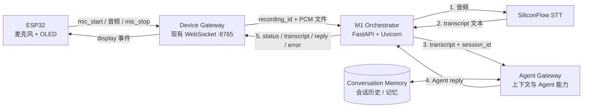

# Desktoppy 架构与演进边界

## 1. 产品目标

Desktoppy 不是单独的录音设备，而是一个桌宠形态的 Agent 终端：

```text
用户说话
  → 桌宠本地收音
  → ECS 转写并驱动 Agent / Chatbox
  → Agent 完成对话或任务
  → 结果、状态或通知回到桌宠屏幕
```

后续增加扬声器后，输出可以从屏幕扩展为 TTS。功能闭环验证完成后，再进入外壳、电源、PCB 和售卖形态设计。

## 2. 当前验证架构（M0）

```text
ESP32-C3
  ├─ GPIO1 按键
  ├─ INMP441 / I2S（仅录音时启动）
  ├─ SPIFFS 临时录音（松手后上传）
  ├─ SSD1315 OLED
  └─ WebSocket
        │
        ▼
ECS despod.service :8765
  ├─ 接收 G.711 mu-law 并解码为 16-bit PCM
  ├─ 下发 display / mic_test / ota
  └─ systemd 自动重启 + journald

ECS despod-firmware.service :23717
  └─ 提供 firmware.bin
        │
        ▼
ESP32 OTA 双分区 + 延迟确认 + 回滚
```

### 已实现

- Wi-Fi 配网与自动重连；配网热点不再自动超时退出。
- 本地 mu-law 录音、松手后 WebSocket 上传、ECS PCM 解码、OLED 文字回显。
- I2S 按需启停、30 秒录音上限、低频 OLED 音量刷新。
- HTTP/HTTPS OTA、双分区、下载进度和 systemd 固件服务。
- 新固件连续在线 60 秒后才标记有效。

### 尚未实现

- STT、Agent/Chatbox 调用、任务状态模型和结果摘要。
- 设备身份、鉴权、多设备稳定寻址。
- 音频文件进入 Agent 的正式队列与回调协议。
- 扬声器、TTS 与全双工音频。

## 3. 下一阶段（M1）：Agent 消息闭环

建议先保持现有 WebSocket，不急于引入 MQTT。STT 与 Agent 是严格串行关系：先把音频变成文本，再把文本和会话上下文交给 Agent。



OLED 只有一条物理回传通道（现有 WebSocket），但有多种逻辑事件：录音中、处理中、STT 文本、Agent 回复和错误提示。录音期间的音量条仍然可以完全在 ESP32 本地绘制，不经过 ECS。

M1 必须先定义：

- 一次录音对应一个 `recording_id`，一次对话任务对应一个 `job_id`。
- Agent 状态至少包含 `received / transcribing / working / done / failed`。
- Agent Gateway 接收 `session_id`、设备身份和 transcript，负责读取会话上下文、调用 Agent、保存本轮对话。
- OLED 只展示短状态、文本摘要和错误；长内容交给 Chatbox/Agent Gateway。
- 网络中断后允许查询最后一个任务状态，不能依赖一次性推送。

## 4. ECS 轻量化后端边界

ECS 实测约为 2 vCPU、1.6 GiB 可见内存（当前可用约 519 MiB）、40 GiB 磁盘；现有 WebSocket、OTA 和 Hermes 服务已经常驻。因此 M1 不应额外引入 Redis、RabbitMQ、Celery、Kubernetes 或多进程 worker。

### 推荐组合

- FastAPI + Uvicorn 单进程：提供健康检查、任务状态 API，并可逐步承载 WebSocket；FastAPI 原生支持文本、二进制和 JSON WebSocket 消息。
- systemd：负责开机启动、重启和日志，与现有 `despod.service` 保持一致。
- SQLite 元数据表：只保存 `job_id`、状态、时间、设备和文件路径；PCM 音频留在文件系统，不塞进数据库。
- 进程内 `asyncio.Queue(maxsize=1)`：作为轻量调度器；先把任务写入 SQLite，再放入队列。进程重启后扫描 `queued/running` 任务恢复，避免纯内存队列丢任务。
- 单设备先限制单个 in-flight job；后续有多设备压力再扩容，不提前引入外部消息队列。

### Staging / Canary

- M0 `despod.service :8765` 和 v0.0.103 OTA 继续不动。
- M1 以独立 systemd 服务运行，初期只绑定 `127.0.0.1:8786`，不对公网开放。
- `8765` 是 ECS 对 ESP32 的入站 WebSocket 监听端口；ECS 调用 STT/Agent 的出站连接使用临时端口，不需要为模型 API 固定开放入站端口。
- Device Gateway 先收到 identify，再仅对目标 MAC 开启 canary 路由；其他设备继续走 M0。当前只有一块板子时，这就是“按设备灰度”，不需要修改固件。
- 当前 WebSocket 是 M0 的传输兜底：它继续负责连接、音频接收和 OLED 事件下发。M1 失败时应返回可见错误并保持 M0 服务存活，不把 M1 失败升级成设备断线或 OTA 风险。
- ESP32 当前固定连接 `8765`，所以仅启动公网 `8766` 不会自动收到板子的流量；如果未来需要外部访问 M1，再通过认证的 HTTPS 反向代理公开，而不是直接暴露内部端口。

### Uvicorn 的角色

- FastAPI 是应用框架：定义 HTTP API、WebSocket 路由、数据模型和业务依赖。
- Uvicorn 是 ASGI 服务器：实际启动 Python 进程、监听端口、运行 FastAPI，并处理 HTTP/WebSocket 事件循环。
- 当前 ECS 只运行一个 Uvicorn 进程，由 systemd 负责启动和重启；不提前开启多 worker，避免每个 worker 重复占用内存。

### 多 ECS / Agent Session 演进

产品化后即使仍然只有一块 ESP32，只要部署多个 ECS，就需要把“连接状态”和“会话状态”分开：

1. Device Gateway 保留当前 WebSocket 连接映射；设备重连后可以落到任意 ECS。
2. Conversation Memory / Session Store 放到共享数据库，而不是某一台 ECS 的内存或 SQLite 文件。
3. 音频文件放对象存储或独立文件服务；数据库只保存引用和任务状态。
4. Orchestrator 尽量无状态，通过 `device_id`、`session_id`、`job_id` 读取共享状态。
5. 只有出现并发任务、跨 ECS 重试或发布削峰时，才增加 Redis/消息队列。

Railway 可以作为未来的部署平台，但不是 Session 的解决方案。它可以托管 FastAPI 容器；Session 仍然需要共享数据库、对象存储和必要的队列。当前阶段应先保持部署目标可替换：代码按容器/环境变量运行，先在 ECS systemd 上验证，再决定是否迁移 Railway 或其它托管平台。

### 产品记忆与工程留痕分离

- 产品运行时需要的是 Conversation Memory：会话历史、上下文和用户/设备相关记忆。
- Hermes trace、HANDOFF、Git 记录属于开发协作和运维留痕，不进入 Agent 的实时响应链路，也不应影响 OLED 回显。

## 5. 后续阶段

### M2：声音输出

增加扬声器和 TTS 前先确认硬件是否需要换为 ESP32-S3。目标是播放结果提示和短回复，不在当前 C3 原型上强行实现全双工。

### M3：商品化

- 定制 PCB 与可靠按键，避免使用启动绑带脚。
- 3D 打印外壳、散热、麦克风声学腔体和扬声器位置。
- USB-C 供电、电池保护和充电安全验证。
- 设备唯一身份、配网安全、TLS、固件签名和 OTA 灰度/回滚。
- 量产烧录、出厂测试、售后诊断和版本追踪。

## 6. 当前明确不做

- 不为单台验证设备提前引入 MQTT/Broker。
- 不在 STT/Agent 闭环完成前投入完整工业设计。
- 不把纯 HTTP、无设备鉴权的验证链路直接作为销售版本。
